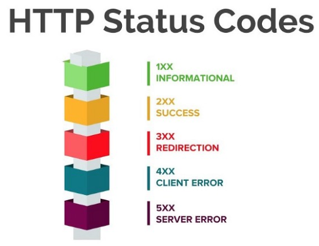

# HTTP 프로토콜
### HTTP 프로토콜?

##### 프로토콜(Protocol)
* 컴퓨터나 원거리 통신 장비 사이에서 메시지를 주고 받는 `양식과 규칙 체계`

##### HTTP(Hypertext Transfer Protocol)
* 인터넷상에서 데이터를 주고 받기 위한 서버/클라이언트 모델을 따르는 프로토콜
* 어떤 종류의 데이터든지 전송가능(문서, 이미지, 동영상, 오디오 등)

##### 특징

1. stateless

##### Methods

1. GET
2. POST
3. Put
4. Delete

##### Status Code

https://shlee0882.tistory.com/107