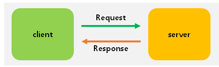

# Request(요청)와 Response(응답)

#### Client 

* 서버에 서비스를 요청하는 클라이언트 소프트웨어(IE, Chrome, Safari)가 설치된 컴퓨터 이용
* 클라이언트는 URI(Uniform Resource Identifiers)를 이용해서 서버에 접속하고, 데이터를 요청

#### Sever

* 클라이언트의 요청을 받아서 해석하고, 응답하는 소프트웨어가 설치된 컴퓨터(Apache, nginx) 등이 서버 소프트웨어

#### Request

* 클라이언트가 원하는것을 요구하기 위해 서버에게 보내는 요청문

#### Response

* 클라이언트가 요청한 것에 대한 결과를 클라이언트에게 보내는 응답문

